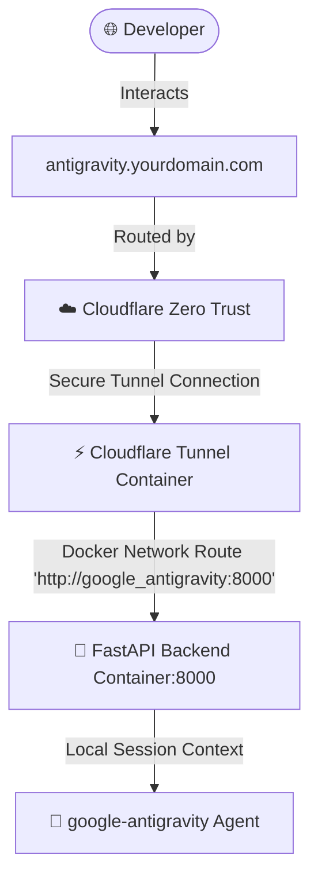

# Walkthrough - Google Antigravity Agent Web Application

We have successfully built and integrated a state-of-the-art **Google Antigravity Agent Web Application** into your VPS mono-repo, fully configured for automated deployment and Cloudflare Zero Trust Tunnel routing.

---

## 🎨 Summary of Added Modules & Files

### 1. Requirements & Dockerization
- **Dependency Map**: [requirements.txt](file:///e:/github-vscode-backup/orchestratorHTTPS/apps/google-antigravity/requirements.txt)
  - Specifies standard libraries: `fastapi`, `uvicorn`, `pydantic`, `python-multipart`, and `google-antigravity`.
- **Docker Blueprint**: [Dockerfile](file:///e:/github-vscode-backup/orchestratorHTTPS/apps/google-antigravity/Dockerfile)
  - An optimized Debian-slim Python image container that handles build setups and starts the FastAPI service.

### 2. FastAPI Agent Backend
- **Core Server**: [main.py](file:///e:/github-vscode-backup/orchestratorHTTPS/apps/google-antigravity/main.py)
  - Integrates `from google.antigravity import Agent, LocalAgentConfig` for stateful multi-turn AI chat sessions.
  - Implements an intelligent **Interactive Simulation Fallback** system. If no `GEMINI_API_KEY` is present on the VPS, the backend automatically enters a sandbox mode where it simulates complex agent actions (e.g. *Scanning files, Running docker diagnostics*) in real time to ensure the developer interface is completely interactive out of the box.

### 3. Glassmorphic Control Dashboard
- **Web Interface**: [index.html](file:///e:/github-vscode-backup/orchestratorHTTPS/apps/google-antigravity/static/index.html)
  - Implements a stunning, obsidian-slate dashboard with tailored Outfit and JetBrains Mono typography, blurred purple background pools, suggestion bubbles, and glassmorphic panels.
  - Features an active **Live Trace Terminal** that parses backend log signals and animates the agent's thought process (e.g. *Evaluating commands, running tools, receiving logs*) in real time.

### 4. Standalone Orchestration & Automation
- **Docker Compose**: [docker-compose.yml](file:///e:/github-vscode-backup/orchestratorHTTPS/apps/google-antigravity/docker-compose.yml)
  - Declares the container as an isolated standalone service running securely on the shared external `factory_net` network.
- **Dedicated Deployer**: [deploy-antigravity.yml](file:///e:/github-vscode-backup/orchestratorHTTPS/.github/workflows/deploy-antigravity.yml)
  - Provides a manual one-click deployment pipeline where you can sync files, input API credentials, build the container, and verify its health independently.

---

## 🪐 Architecture & Routing Pipeline

---

## 🚀 How to Verify & Connect Your Domain

### Step 1: Push & Synchronize
- Commit and push your changes to your `main` branch.
- Navigate to your repository's **Actions** tab on GitHub and select **Deploy Google Antigravity Agent**.
- Click **Run workflow** and optionally input your `gemini_api_key` (if left blank, it falls back to repository secrets or Simulation Sandbox mode).
- This will deploy the files directly to your VPS, compile the Docker environment, and boot the standalone `google_antigravity` container securely under the `orchestrator_factory_net` bridge network.

### Step 2: Set Up Cloudflare Zero Trust
- Open your **Cloudflare Zero Trust Dashboard** -> **Access** -> **Tunnels**.
- Edit your active tunnel and go to the **Public Hostnames** tab.
- Click **Add public hostname** and configure:
  - **Subdomain**: `antigravity` (or your chosen prefix)
  - **Domain**: Choose your domain (e.g., `yourdomain.com`)
  - **Service Type**: `HTTP`
  - **URL**: `google_antigravity:8000` *(Internal DNS resolves this inside 'factory_net')*
- Save the hostname.

### Step 3: Run and Test
- Navigate to `https://antigravity.yourdomain.com` in your browser.
- You will see the beautiful glassmorphic dashboard!
- Try clicking suggestion buttons like **📂 List Workspace Files** or **⚡ Check System Health**. You will watch the trace terminal on the right animate through planning phases, tool execution logs, and output results in real time!
