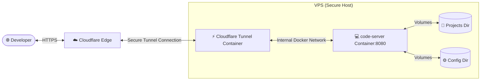

# 💻 VS Code in Browser (code-server) VPS Integration

This directory contains the Dockerized environment and architectural configuration for deploying and running a fully featured **VS Code in Browser (code-server)** on your VPS.

---

## 🏗️ Architecture & Security Model

`code-server` runs inside a lightweight Docker container securely attached to the orchestrator's bridge network (`factory_net` / `orchestrator_factory_net`). It features a two-tiered security boundary:

1. **Access Authorization**: Password-authenticated access (set dynamically during deployment) guarding the editor workspace.
2. **Network Isolation**: By default, the port is bound to `127.0.0.1:8080`, rendering it unreachable via the host's public IP. All routing is negotiated securely through **Cloudflare Zero Trust Tunnels**, bypassing the need to open firewall ports or deal with local SSL termination.

---

## 🚀 How to Deploy

To deploy or update `code-server` on your VPS, navigate to the **Actions** tab in this GitHub repository:

1. Click on the **Deploy code-server (VS Code in Browser)** workflow.
2. Select **Run workflow**.
3. Input your desired **VS Code password** (minimum 8 characters) in the input prompt.
4. Click **Run workflow** to initiate the SSH deployment.

The workflow will:
- Establish proper volume folders on your VPS: `~/projects` and `~/.config/code-server`.
- Join the container to the active orchestrator bridge network.
- Spin up the new container with your requested password and clean up any older instances.

---

## ☁️ Cloudflare Routing Setup

Once the deployment action completes, you can route your custom subdomain (e.g., `vscode.yourdomain.com`) directly to `code-server` through **Cloudflare Zero Trust**:

### Option A: Internal Docker Routing (Highly Recommended 🔐)
Since the `code-server` container and your main Cloudflare `tunnel` container share the same `orchestrator_factory_net` bridge network, Cloudflare can communicate with the service directly using its container name. **This does not expose any host ports to the loopback interface.**

1. Navigate to the **Cloudflare Zero Trust Dashboard** -> **Access** -> **Tunnels**.
2. Click **Edit** on your active tunnel.
3. Select the **Public Hostname** tab and click **Add a public hostname**.
4. Configure the route:
   - **Subdomain**: `vscode` (or your preferred subdomain)
   - **Domain**: Choose your domain (e.g., `yourdomain.com`)
   - **Service Type**: `HTTP`
   - **URL**: `code-server:8080`
5. Click **Save hostname**.

---

### Option B: Localhost Binding Route (Fallback 🔗)
If your Cloudflare Tunnel is running outside of Docker (as a host-level systemd service) or you prefer using loopback routing, the container maps port `8080` to the host's localhost loopback.

1. In the **Public Hostname** setup, set:
   - **Service Type**: `HTTP`
   - **URL**: `localhost:8080` or `127.0.0.1:8080`
2. Click **Save hostname**.

---

## 📂 Persistence & Workspace Path

- **Source Projects**: Mounted at `/home/coder/projects` inside the container. This maps directly to `~/projects` on your VPS root directory. Any changes you make inside VS Code are instantly written to the host filesystem.
- **Settings & Extensions**: Saved under `~/.config/code-server` on the VPS to ensure your user settings, keyboard shortcuts, and installed VS Code extensions persist when the container is rebuilt or updated.

> [!TIP]
> **Performance Tip**: Since files are stored natively on the VPS, terminal actions and git workflows inside `code-server` run at bare-metal speeds with immediate feedback!
