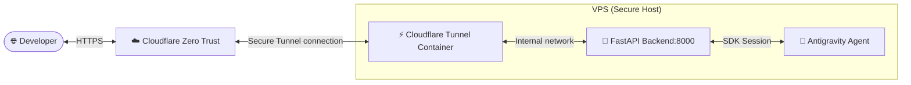

# 🪐 Google Antigravity Agent Web Application

This directory contains the Python FastAPI backend, glassmorphic chat interface, and Docker configurations for running the **Google Antigravity AI Agent Platform** on your VPS.

---

## 🏗️ Architecture & Interface Flow

The application bridges a modern, glassmorphic developer dashboard with the **Google Antigravity SDK** for autonomous AI agents.

### Key Features
- **FastAPI Core**: A high-performance Python backend serving the web application and chat endpoints.
- **Glassmorphic UI**: Obsidian-slate styling with suggestions, session caching, and full responsive support.
- **Live Terminal Feed**: A dual-panel interface displaying an active trace terminal that logs the agent's thought process, tool execution chains, and environment queries.
- **Fail-Safe Simulation Sandbox**: Instantly active out of the box. If a `GEMINI_API_KEY` is not present, the backend automatically transitions to a simulated demonstration mode to show full functional capabilities and terminal log updates, preventing system crashes.

---

## 🚀 How to Deploy

To deploy or update the Google Antigravity Agent application on your VPS:

1. **Commit and Push**: Commit and push the new `apps/google-antigravity/` folder and the workflow configurations to your `main` branch.
2. **Trigger Dedicated Deploy**:
   - Go to the **Actions** tab of your repository on GitHub.
   - Select **Deploy Google Antigravity Agent** from the left sidebar.
   - Click **Run workflow**.
   - *(Optional)* Input your **Gemini API Key** in the input field to connect real AI models. If left blank, it will automatically fall back to the repository's `GEMINI_API_KEY` secret, or run in Simulation Sandbox mode if neither is configured.
   - Click **Run workflow** to deploy the standalone stack.

---

## 🔑 Activating Live Agent Models

By default, the application runs in a **Simulation Sandbox** so you can interact with the terminal logs immediately. 

To activate the real autonomous agent model, you can supply your API key in **two ways**:
- **Method A (Dynamic Input)**: Provide your `GEMINI_API_KEY` directly inside the workflow input field when triggering the deployment action on GitHub.
- **Method B (Repository Secret)**: Define a repository secret named `GEMINI_API_KEY` in **Repository Settings** -> **Secrets and variables** -> **Actions**. The workflow will automatically pick it up if the manual input field is left empty.

---

## ☁️ Cloudflare Routing Setup

To access your new agent console publicly, route it securely via your Cloudflare Tunnel:

1. Navigate to the **Cloudflare Zero Trust Dashboard** -> **Access** -> **Tunnels**.
2. Edit your active tunnel and go to the **Public Hostnames** tab.
3. Click **Add public hostname** and set:
   - **Subdomain**: `antigravity` (e.g. `antigravity.yourdomain.com`)
   - **Domain**: Choose your active domain
   - **Service Type**: `HTTP`
   - **URL**: `google_antigravity:8000` *(This routes directly inside the Docker network!)*
4. Save the hostname, visit `https://antigravity.yourdomain.com`, and start coordinating agent plans!
