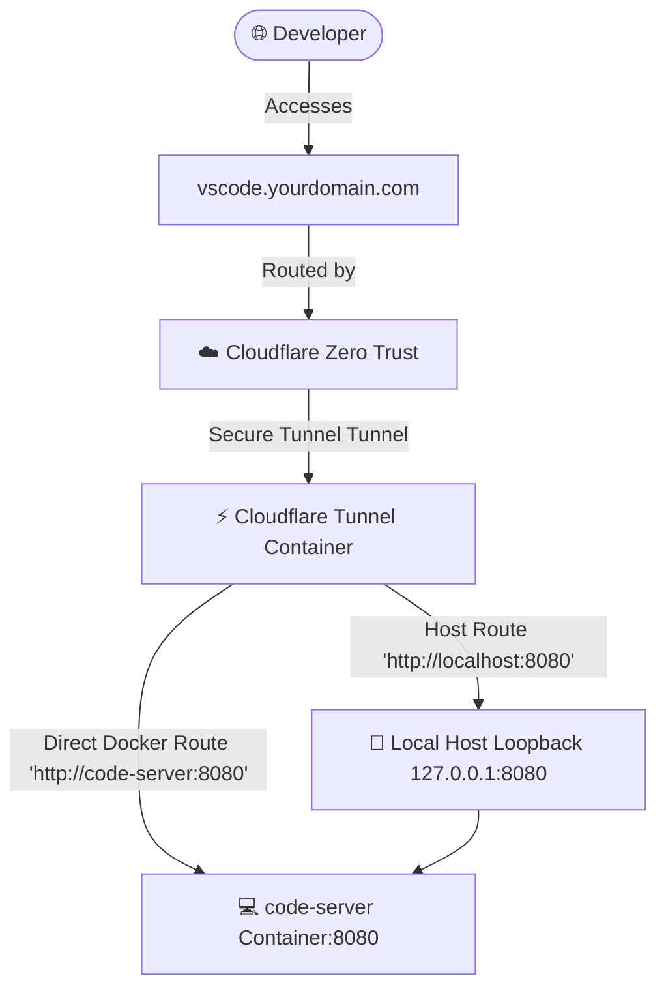

# Walkthrough - Deploy code-server (VS Code in Browser) to VPS

We have successfully integrated a complete, robust deployment framework for **code-server (VS Code in Browser)** on your VPS. The system is designed to align with your orchestrator's architecture, featuring full local and containerized Cloudflare Tunnel routing.

---

## 🛠️ Summary of Changes Made

### 1. Created GitHub Actions Workflow
- **File**: [.github/workflows/deploy-code-server.yml](file:///e:/github-vscode-backup/orchestratorHTTPS/.github/workflows/deploy-code-server.yml)
- **Features**:
  - `workflow_dispatch` trigger allowing dynamic password submission.
  - Resilient secret lookups supporting both your orchestrator defaults (`GLOBAL_VPS_IP`, `GLOBAL_SSH_KEY`) and standard classic configurations (`VPS_HOST`, `VPS_SSH_KEY`).
  - Automated network setup: Creates and joins the container to the orchestrator's Docker bridge network (`orchestrator_factory_net`).
  - Secure loopback mapping: Maps port `8080` to loopback `127.0.0.1` on the VPS to prevent public ports exposure.
  - Automatic folder provisioning: Setups and mounts `~/projects` and `~/.config/code-server` for persistent settings, extensions, and source code.

### 2. Created Standing Application Setup
- **Compose Config**: [apps/code-server/docker-compose.yml](file:///e:/github-vscode-backup/orchestratorHTTPS/apps/code-server/docker-compose.yml)
  - Standardizes the compose layout, matching the structure of other dynamic apps like `mail-server` or `agentic_ai`.
- **Developer Guide**: [apps/code-server/README.md](file:///e:/github-vscode-backup/orchestratorHTTPS/apps/code-server/README.md)
  - Features setup guidelines, security overviews, persistence maps, and step-by-step instructions for Cloudflare Zero Trust.

---

## 🪐 Architecture & Routing Pipeline

---

## 🚀 How to Validate & Trigger Deployment

To verify the setup:

1. **Push Changes to GitHub**:
   Push the main branch containing the new files to your repository:
   - `.github/workflows/deploy-code-server.yml`
   - `apps/code-server/`

2. **Trigger the Deployment**:
   - Go to your repository on **GitHub.com**.
   - Navigate to the **Actions** tab.
   - Select **Deploy code-server (VS Code in Browser)** from the left sidebar.
   - Click **Run workflow**, input a secure password (min 8 characters), and click **Run workflow**.

3. **Configure Cloudflare Zero Trust**:
   - Open your **Cloudflare Zero Trust Dashboard** -> **Access** -> **Tunnels**.
   - Select your active tunnel, go to the **Public Hostnames** tab, and click **Add public hostname**.
   - Enter your subdomain (e.g., `vscode`) and point it to:
     - **Service Type**: `HTTP`
     - **URL**: `code-server:8080` (Highly secure direct Docker routing!)
   - Save the hostname, visit `https://vscode.yourdomain.com`, log in with your chosen password, and start coding in your browser!
